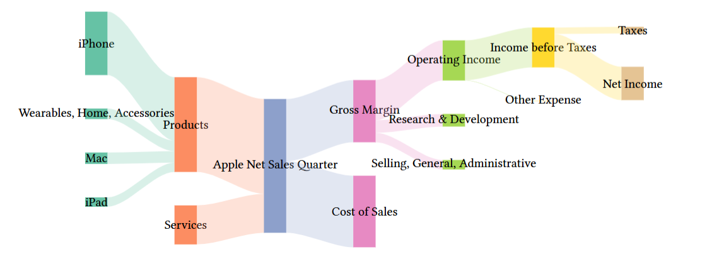

# typst-ribbons

A library for creating ribbon diagrams, such as Sankey and Chord diagrams, in Typst.

Status: Early development.

After finishing core features and documentation, this library will be published as a Typst package.

typst-ribbons is based on [cetz](https://github.com/cetz-package/cetz).

## Demo

Screenshots from WIP demos:

Demo data comes from SankeyMatic and d3-chord.